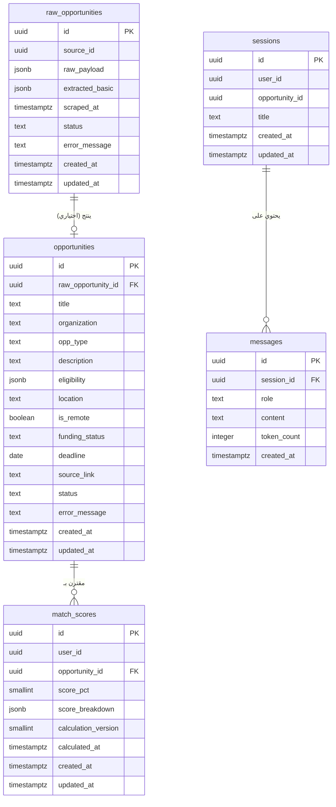

# تصميم قاعدة بيانات PostgreSQL — خدمة بايثون المركزية (Python Core Service)

## منصة Levora — طبقة السكرابينغ، المطابقة، والذكاء الاصطناعي

**الإصدار:** 2.0 (مُعاد هيكلته وفق القرارات التقنية الجديدة)  
**المبنى على:** القرارات التقنية عالية المستوى المُحدّثة (19 أغسطس 2026)  
**تاريخ التعديل:** 23 أغسطس 2026  
**محرك قاعدة البيانات:** PostgreSQL 15+  
**حالة الوثيقة:** معتمدة للتطوير  

---

> **ملاحظات منهجية حول هذا الإصدار:**
>
> **1) إلغاء النسخ المحلية (No Local Copies):** طبقاً لقرار "القراءة المباشرة مع صلاحيات محدودة"، تم **إزالة جميع جداول النسخ المحلية** من هذا المخطط. خدمة بايثون **لا تخزن** بيانات المستخدمين (`users`) أو المصادر (`sources`) محلياً. تقوم بقراءة هذه البيانات مباشرة من قاعدة البيانات الرئيسية عبر صلاحيات `SELECT` محدودة على `Views` مخصصة.
>
> **2) آلية اكتشاف التغييرات:** تعتمد خدمة بايثون على عمود `matchingVersion` في جدول `core.user_profiles` (في قاعدة البيانات الرئيسية) لاكتشاف المستخدمين الذين تغيرت بياناتهم المؤثرة على المطابقة. تقوم خدمة بايثون بتشغيل استعلام دوري للتحقق من التغييرات، مما يلغي الحاجة إلى جداول مزامنة أو إصدارات محلية.
>
> **3) التركيز على المسؤوليات الأساسية:** يقتصر هذا المخطط على الجداول التي تديرها خدمة بايثون حصرياً:
> - **السكرابينغ:** البيانات الخام (`raw_opportunities`) فقط (المصادر تُقرأ من قاعدة الرئيسية).
> - **الفرص النظيفة المؤقتة:** الفرص بعد التنظيف وقبل نقلها للرئيسية (`opportunities`).
> - **المطابقة:** نتائج المطابقة مع تفاصيل الحساب (`match_scores`).
> - **الذكاء الاصطناعي:** جلسات ورسائل المحادثة (`sessions`, `messages`).
>
> **4) عدم وجود مفاتيح أجنبية للخدمة الرئيسية:** لا توجد علاقات (Foreign Keys) مباشرة مع جداول الخدمة الرئيسية. الحقول مثل `user_id` و `source_id` تُستخدم كمعرفات (Identifiers) فقط، دون قيود مرجعية، لضمان عدم الاقتران على مستوى قاعدة البيانات.
>
> **5) التبسيط:** تم إزالة جميع جداول المزامنة والإصدارات (`sync_tracking`, `profile_versions`, إلخ) التي كانت موجودة في التصميم السابق، تماشياً مع هدف التبسيط المعماري الجديد.

---

## جدول المحتويات

1. [نموذج ERD](#1-نموذج-erd)
2. [نص DDL الكامل](#2-نص-ddl)
3. [استراتيجية الفهرسة](#3-استراتيجية-الفهرسة)
4. [جاهزية النمو والتوسع المستقبلي](#4-جاهزية-النمو-والتوسع-المستقبلي)
5. [توصيات الأداء والأمان](#5-توصيات-الأداء-والأمان)

---

## 1. نموذج ERD

### 1.1 المخططات المنطقية (Schemas)

المخططات (Schemas) هي **حاويات منطقية** تُستخدم لتجميع الجداول المتعلقة ببعضها البعض حسب الوظيفة، مما يسهل الصيانة ويفصل المسؤوليات بوضوح.

| Schema | الغرض | الجداول التي يحتويها |
|--------|-------|----------------------|
| `scraping` | كل ما يتعلق بعملية جلب البيانات الخام من المصادر الخارجية | `raw_opportunities` |
| `core` | الفرص النظيفة المؤقتة (قبل نقلها للخدمة الرئيسية) | `opportunities` |
| `matching` | نتائج المطابقة وتفاصيل الحساب | `match_scores` |
| `ai` | جلسات ورسائل الذكاء الاصطناعي | `sessions`, `messages` |

**ملاحظة:** لا يحتوي هذا المخطط على جداول للمستخدمين أو المصادر، حيث تُقرأ مباشرة من قاعدة البيانات الرئيسية.

### 1.2 الكيانات الرئيسية والعلاقات

| الكيان الأساسي | العلاقات | الوصف |
|----------------|----------|-------|
| `scraping.raw_opportunities` | (1) → (0..1) `core.opportunities` | كل سجل خام قد ينتج فرصة نظيفة واحدة (أو لا ينتج إذا فشل التنظيف) |
| `core.opportunities` | (1) → (0..N) `matching.match_scores` | كل فرصة نظيفة لها نتائج مطابقة مع عدة مستخدمين |
| `ai.sessions` | (1) → (0..N) `ai.messages` | كل جلسة تحتوي على عدة رسائل (سجل المحادثة) |

**ملاحظة حول المفاتيح الخارجية:** لا توجد علاقات مباشرة مع جداول الخدمة الرئيسية. الحقول مثل `user_id` و `source_id` هي معرفات تُستخدم للربط المنطقي، وليست مفاتيح أجنبية فعلية.

### 1.3 مخطط العلاقات (ERD) — كود Mermaid

انسخ الكود التالي وألصقه في [Mermaid Live Editor](https://mermaid.live/) لعرض المخطط البياني للعلاقات:



### 1.4 قائمة الجداول الفعلية

| # | اسم الجدول | المخطط (Schema) | الوصف الموجز |
|---|------------|-----------------|--------------|
| 1 | `raw_opportunities` | `scraping` | البيانات الخام كما تُجلب من المصادر الخارجية (قبل التنظيف) |
| 2 | `opportunities` | `core` | الفرص النظيفة الناتجة عن التنظيف، الجاهزة للقراءة من قبل الخدمة الرئيسية |
| 3 | `match_scores` | `matching` | نتائج المطابقة المحسوبة مع تفاصيل الحساب وإصدار الخوارزمية |
| 4 | `sessions` | `ai` | جلسات المحادثة مع المساعد الذكي |
| 5 | `messages` | `ai` | سجل رسائل كل جلسة محادثة |

---

## 2. نص DDL

```sql
-- ============================================================
-- قاعدة بيانات خدمة بايثون المركزية (Python Core Service)
-- الإصدار 2.0 (وفق القرارات التقنية الجديدة) — PostgreSQL 15+
-- ============================================================

CREATE EXTENSION IF NOT EXISTS "pgcrypto";   -- توليد UUID
CREATE EXTENSION IF NOT EXISTS "pg_trgm";    -- دعم المطابقة الغامضة (اختياري)

CREATE SCHEMA IF NOT EXISTS scraping;
CREATE SCHEMA IF NOT EXISTS core;
CREATE SCHEMA IF NOT EXISTS matching;
CREATE SCHEMA IF NOT EXISTS ai;

-- ============================================================
-- دالة مساعدة لتحديث updated_at تلقائياً
-- ============================================================
CREATE OR REPLACE FUNCTION set_updated_at()
RETURNS TRIGGER AS $$
BEGIN
  NEW.updated_at = now();
  RETURN NEW;
END;
$$ LANGUAGE plpgsql;

-- ============================================================
-- 2.1 البيانات الخام والسكرابينغ (scraping)
-- ============================================================

-- ملاحظة: لا يوجد جدول sources هنا.
-- يتم قراءة المصادر مباشرة من قاعدة البيانات الرئيسية (core.opportunity_sources)
-- عبر صلاحيات قراءة محدودة، ويتم تمرير source_id مع كل عملية جلب.

CREATE TABLE scraping.raw_opportunities (
    id                UUID PRIMARY KEY DEFAULT gen_random_uuid(),
    source_id         UUID NOT NULL,                               -- معرف المصدر من الخدمة الرئيسية (بدون FK)
    raw_payload       JSONB NOT NULL,                              -- المحتوى الكامل كما هو من المصدر
    extracted_basic   JSONB,                                       -- بيانات أساسية مستخلصة للتوجيه السريع
    scraped_at        TIMESTAMPTZ NOT NULL DEFAULT now(),
    status            TEXT NOT NULL DEFAULT 'pending' CHECK (status IN ('pending', 'processing', 'processed', 'failed')),
    error_message     TEXT,
    created_at        TIMESTAMPTZ NOT NULL DEFAULT now(),
    updated_at        TIMESTAMPTZ NOT NULL DEFAULT now()
);
COMMENT ON TABLE scraping.raw_opportunities IS 'البيانات الخام المسترجعة من السكرابينغ. المصادر تُقرأ من قاعدة الرئيسية.';

CREATE TRIGGER trg_raw_updated_at BEFORE UPDATE ON scraping.raw_opportunities
FOR EACH ROW EXECUTE FUNCTION set_updated_at();

-- ============================================================
-- 2.2 الفرص النظيفة المؤقتة (core)
-- ============================================================

-- تحتوي على الفرص بعد التنظيف والتحويل.
-- تقوم الخدمة الرئيسية بقراءة هذا الجدول مباشرة (عبر صلاحيات محدودة)
-- لنقل الفرص إلى قاعدتها وعرضها على المشرفين.

CREATE TABLE core.opportunities (
    id                UUID PRIMARY KEY DEFAULT gen_random_uuid(),
    raw_opportunity_id UUID REFERENCES scraping.raw_opportunities(id) ON DELETE SET NULL,
    
    -- البيانات النظيفة المستخلصة
    title             TEXT NOT NULL,
    organization      TEXT NOT NULL,
    opp_type          TEXT NOT NULL CHECK (opp_type IN ('scholarship','internship','job','fellowship','research_grant')),
    description       TEXT NOT NULL,
    eligibility       JSONB NOT NULL DEFAULT '{}'::jsonb,
    location          TEXT,
    is_remote         BOOLEAN NOT NULL DEFAULT false,
    funding_status    TEXT CHECK (funding_status IN ('fully_funded','partially_funded','unfunded')),
    deadline          DATE,
    source_link       TEXT NOT NULL,
    
    -- حالة المعالجة داخل خدمة بايثون
    status            TEXT NOT NULL DEFAULT 'pending' CHECK (status IN ('pending', 'cleaned', 'failed')),
    error_message     TEXT,
    
    created_at        TIMESTAMPTZ NOT NULL DEFAULT now(),
    updated_at        TIMESTAMPTZ NOT NULL DEFAULT now()
);
COMMENT ON TABLE core.opportunities IS 'الفرص بعد التنظيف والتحويل. تُقرأ من قبل الخدمة الرئيسية لنقلها لقاعدتها.';

CREATE TRIGGER trg_opportunities_updated_at BEFORE UPDATE ON core.opportunities
FOR EACH ROW EXECUTE FUNCTION set_updated_at();

-- ============================================================
-- 2.3 نتائج المطابقة (matching)
-- ============================================================

-- يتم حساب النتائج بناءً على بيانات المستخدمين المقروءة من قاعدة الرئيسية
-- والفرص النظيفة الموجودة في هذا الجدول.

CREATE TABLE matching.match_scores (
    id                   UUID PRIMARY KEY DEFAULT gen_random_uuid(),
    user_id              UUID NOT NULL,                              -- معرف المستخدم من الخدمة الرئيسية (بدون FK)
    opportunity_id       UUID NOT NULL REFERENCES core.opportunities(id) ON DELETE CASCADE,
    
    score_pct            SMALLINT NOT NULL CHECK (score_pct BETWEEN 0 AND 100),
    score_breakdown      JSONB NOT NULL DEFAULT '{}'::jsonb,        -- تفاصيل الحساب والمعايير
    calculation_version  SMALLINT NOT NULL DEFAULT 1,               -- إصدار خوارزمية المطابقة
    
    calculated_at        TIMESTAMPTZ NOT NULL DEFAULT now(),
    created_at           TIMESTAMPTZ NOT NULL DEFAULT now(),
    updated_at           TIMESTAMPTZ NOT NULL DEFAULT now(),
    
    UNIQUE (user_id, opportunity_id)
);
COMMENT ON TABLE matching.match_scores IS 'نتائج المطابقة المحسوبة. تُقرأ من قبل الخدمة الرئيسية لعرضها للمستخدمين.';

CREATE TRIGGER trg_match_scores_updated_at BEFORE UPDATE ON matching.match_scores
FOR EACH ROW EXECUTE FUNCTION set_updated_at();

-- ============================================================
-- 2.4 الذكاء الاصطناعي (ai)
-- ============================================================

-- جلسات المحادثة
CREATE TABLE ai.sessions (
    id                UUID PRIMARY KEY DEFAULT gen_random_uuid(),
    user_id           UUID NOT NULL,                              -- معرف المستخدم من الخدمة الرئيسية (بدون FK)
    opportunity_id    UUID REFERENCES core.opportunities(id) ON DELETE SET NULL,   -- للسياق (اختياري)
    title             TEXT,                                       -- عنوان الجلسة (مولد تلقائياً)
    created_at        TIMESTAMPTZ NOT NULL DEFAULT now(),
    updated_at        TIMESTAMPTZ NOT NULL DEFAULT now()
);
COMMENT ON TABLE ai.sessions IS 'جلسات المحادثة مع المساعد الذكي، مرتبطة بالمستخدم واختيارياً بالفرصة.';

CREATE TRIGGER trg_sessions_updated_at BEFORE UPDATE ON ai.sessions
FOR EACH ROW EXECUTE FUNCTION set_updated_at();

-- رسائل المحادثة
CREATE TABLE ai.messages (
    id                UUID PRIMARY KEY DEFAULT gen_random_uuid(),
    session_id        UUID NOT NULL REFERENCES ai.sessions(id) ON DELETE CASCADE,
    role              TEXT NOT NULL CHECK (role IN ('user','assistant','system')),
    content           TEXT NOT NULL,
    token_count       INTEGER,                                     -- لتتبع استخدام LLM
    created_at        TIMESTAMPTZ NOT NULL DEFAULT now()
);
COMMENT ON TABLE ai.messages IS 'سجل رسائل كل جلسة محادثة.';

-- ============================================================
-- 2.5 فهارس الأداء (تم دمجها مع استراتيجية الفهرسة في القسم 3)
-- ============================================================

-- يتم إنشاء الفهارس الموصى بها في القسم المنفصل أدناه.
```

---

## 3. استراتيجية الفهرسة

| # | الجدول | العمود / التعبير | نوع الفهرس | السبب |
|---|--------|------------------|------------|-------|
| 1 | `scraping.raw_opportunities` | `(status, scraped_at DESC)` | B-tree | استعلامات معالجة البيانات الخام (جلب السجلات المعلقة للتنظيف) |
| 2 | `scraping.raw_opportunities` | `source_id` | B-tree | ربط السجلات الخام بمصدرها (للتتبّع والتحليل) |
| 3 | `core.opportunities` | `status` | B-tree | تصفية الفرص حسب حالة المعالجة (pending/cleaned/failed) |
| 4 | `core.opportunities` | `(status, created_at)` | B-tree مركّب | جلب الفرص النظيفة الجديدة للخدمة الرئيسية |
| 5 | `core.opportunities` | `deadline` | B-tree | ترتيب الفرص حسب الموعد النهائي (للمعالجة) |
| 6 | `matching.match_scores` | `(user_id, score_pct DESC)` | B-tree مركّب | استعلامات توصيات المستخدم مرتبة تنازلياً (تقرأها الرئيسية) |
| 7 | `matching.match_scores` | `opportunity_id` | B-tree | ربط عكسي (الفرص التي طابقتها لمستخدمين) |
| 8 | `matching.match_scores` | `calculation_version` | B-tree | إعادة حساب نتائج المطابقة عند ترقية الخوارزمية |
| 9 | `ai.sessions` | `(user_id, created_at DESC)` | B-tree مركّب | استرجاع جلسات المستخدم مرتبة زمنياً |
| 10 | `ai.messages` | `(session_id, created_at)` | B-tree مركّب | استرجاع تسلسل رسائل جلسة محددة |

---

## 4. جاهزية النمو والتوسع المستقبلي

تم تصميم هذا المخطط ليكون خفيفاً وقابلاً للتوسع مع نمو النظام:

### 4.1 التقسيم الزمني (Partitioning)

لا يتم استخدام التقسيم الزمني في الإصدار الأول لأن حجم البيانات المتوقع (آلاف الفرص، مئات المستخدمين) لا يبرر تعقيده. ومع ذلك، فإن الجداول الأكثر عرضة للنمو (`scraping.raw_opportunities`, `ai.messages`) تحتوي على عمود `created_at` بصيغة `TIMESTAMPTZ`، مما يسهل تفعيل `PARTITION BY RANGE (created_at)` مستقبلاً عند تجاوز حجم معين (مثلاً 1 مليون سجل).

### 4.2 إدارة حجم البيانات

يمكن تطبيق سياسات أرشفة بسيطة في المراحل المبكرة:
- حذف سجلات `raw_opportunities` التي مضى عليها أكثر من 90 يوماً وتمت معالجتها بنجاح.
- أرشفة رسائل الذكاء الاصطناعي القديمة (أكثر من 6 أشهر) إذا لزم الأمر.

### 4.3 التوسع المستقبلي

| الجدول | استراتيجية التوسع المقترحة |
|--------|---------------------------|
| `core.opportunities` | يمكن إضافة `opp_type` جديدة (`fellowship`, `job`, `research_grant`) عبر `ALTER TABLE` بدون كسر التوافق. |
| `matching.match_scores` | يمكن إضافة أعمدة جديدة (`semantic_score`, `feedback_text`) لدعم المطابقة المتقدمة. |
| `ai.sessions` | يمكن إضافة `application_id` لربط الجلسات بالطلبات في الإصدارات القادمة. |

---

## 5. توصيات الأداء والأمان

### 5.1 الأداء (لمستوى الإطلاق: مئات المستخدمين، آلاف الفرص)

| المعامل | القيمة المقترحة | ملاحظة |
|---------|-----------------|---------|
| `shared_buffers` | 25% من ذاكرة الخادم | كافٍ لحجم v1 |
| `work_mem` | 8–16MB | مناسب للاستعلامات البسيطة في خدمة بايثون |
| `max_connections` | 20–30 | تكفي لخدمة بايثون فقط (لا يوجد اتصالات مباشرة من المستخدمين) |
| `log_min_duration_statement` | 500ms | رصد الاستعلامات البطيئة |

### 5.2 الأمان

- **عزل الشبكة:** قاعدة البيانات في شبكة داخلية (VPC) لا يمكن الوصول إليها إلا من خدمة بايثون نفسها، ومن الخدمة الرئيسية (عبر اتصال آمن).
- **المستخدم المخصص:** استخدام مستخدم قاعدة بيانات مخصص لخدمة بايثون بصلاحيات `CRUD` على جميع الجداول في المخططات الأربعة (`scraping`, `core`, `matching`, `ai`).
- **صلاحيات الخدمة الرئيسية:** تُمنح الخدمة الرئيسية صلاحيات `SELECT` فقط على `core.opportunities` و `matching.match_scores` عبر **مستخدم قاعدة بيانات منفصل**، مع إمكانية استخدام `Views` لعرض حقول محدودة إذا لزم الأمر.
- **تشفير البيانات:** جميع الاتصالات بقاعدة البيانات مشفرة بـ TLS (وفقاً لـ NFR-SEC-01 من SRS).
- **النسخ الاحتياطي:** يتم أخذ نسخ احتياطية يومية مع الاحتفاظ بها لمدة 7 أيام على الأقل، مع إمكانية استعادتها خلال ساعة واحدة.

### 5.3 الصيانة الدورية

- تشغيل `VACUUM ANALYZE` بشكل دوري (أسبوعياً أو حسب الحاجة) للحفاظ على أداء الاستعلامات.
- مراقبة حجم الجداول ونموها، خاصة `scraping.raw_opportunities` و `ai.messages`، واتخاذ إجراءات الأرشفة عند الحاجة.
- تحديث الإحصائيات (`ANALYZE`) بعد عمليات الإدراج الكبيرة.

---

*تم إعداد هذا التصميم بناءً على القرارات التقنية عالية المستوى المُحدّثة بتاريخ 19 أغسطس 2026، مع الالتزام بمبادئ القراءة المباشرة، وإلغاء النسخ المحلية، والتبسيط الشامل للمخطط. يهدف هذا التصميم إلى توفير أساس متين وقابل للتوسع لخدمة بايثون، مع الحفاظ على وضوح الهيكل وسهولة الفهم لجميع أعضاء الفريق.*
